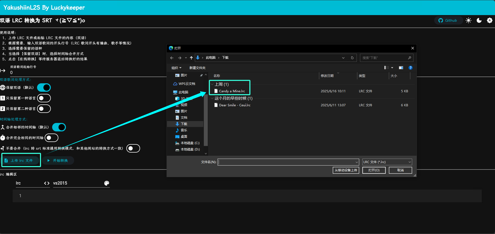
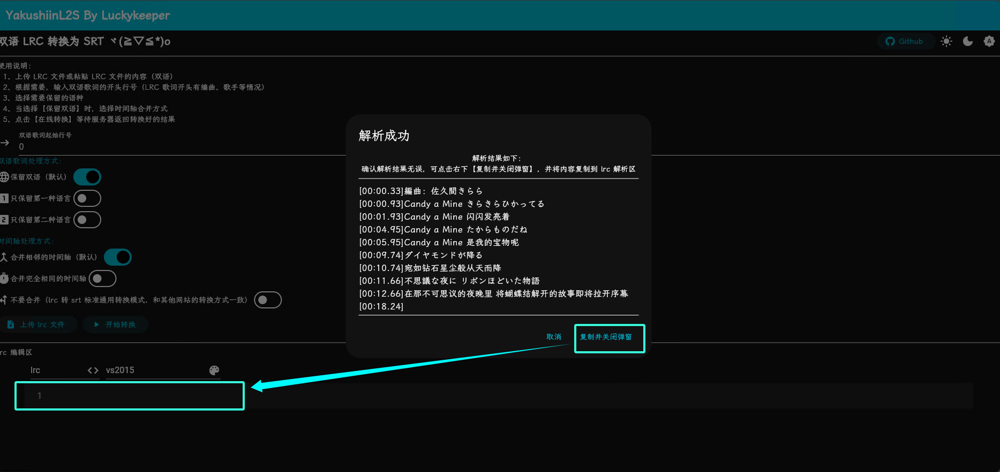
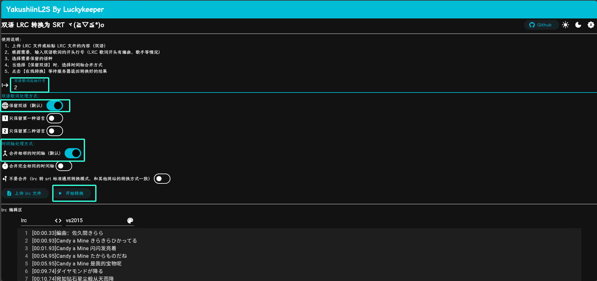
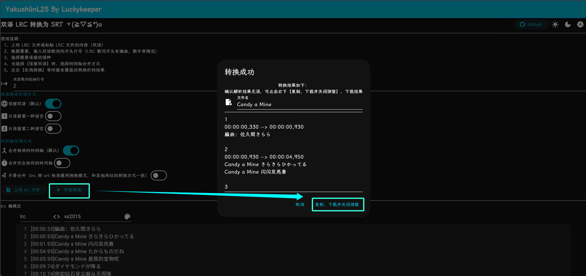
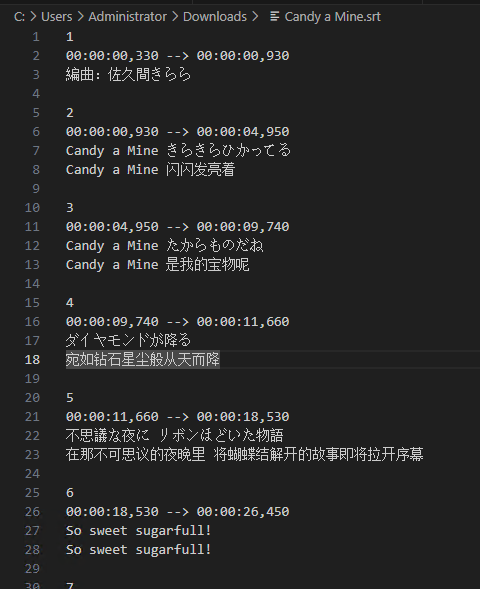

# yakushiinL2S

将双语 lrc 歌词文件转 srt 字幕文件，双语时间轴合并，[luckykeeper/yakushiin_player](https://github.com/luckykeeper/yakushiin_player) 最佳搭档

## 功能

- [x] lrc 转 srt 【标准模式】（和其他 lrc 转 srt 工具相同的功能）
- [x] 可选双语歌词只保留一种语言（例：中日双语=>中文字幕/日语字幕）
- [x] 双语歌词时间轴合并（相同时间轴合并/相邻时间轴合并）

## 使用/预览

1. 从 Github Release 下载最新版本
2. 启动项目，Windows 用户双击下载的 exe 文件运行，linux 用户无需指导
3. 浏览器打开网页，默认地址是 【[http://localhost:44443](http://localhost:44443)】 或 【http://[电脑ip]:44443】，B/S 架构，也可以搭建在线服务
4. 在网页完成转换，步骤：

1、上传 LRC 文件或粘贴 LRC 文件的内容（双语）



如果是上传，请根据提示把解析出来的 LRC 歌词粘贴到 LRC 编辑区（Ctrl + V）



2、根据需要，输入双语歌词的开头行号（LRC 歌词开头有编曲、歌手等情况）

以 [Candy a Mine](https://music.163.com/#/song?id=491233178) 的双语歌词举例：

```lrc
[00:00.33]編曲：佐久間きらら
[00:00.93]Candy a Mine きらきらひかってる
[00:01.93]Candy a Mine 闪闪发亮着
[00:04.95]Candy a Mine たからものだね
[00:05.95]Candy a Mine 是我的宝物呢
```

第一行是编曲，不是双语歌词，双语歌词从第二行开始，所以输入【2】

3、选择需要保留的语种

还是看上面 [Candy a Mine](https://music.163.com/#/song?id=491233178) 的双语歌词，他是以 日语-中文交替出现的，所以【保留第一种语言】就会保留日语删去中文，【保留第二种语言】则反之

4、当选择【保留双语】时，选择时间轴合并方式

当选择保留双语时，时间轴合并方式生效，可以选择【相同时间轴合并】或【相邻时间轴合并】

继续看上面 [Candy a Mine](https://music.163.com/#/song?id=491233178) 的双语歌词，可以发现，日语对应的中文时轴不同，此时如果选择【相同时间轴合并】则不会合并，如果选择【相邻时间轴合并】，则可将中文和日语合并到同一时间轴

5、点击【在线转换】等待服务器返回转换好的结果





转换效果预览



以 [Candy a Mine](https://music.163.com/#/song?id=491233178) 的双语歌词为例，双语歌词起始行号【2】，保留双语，合并相邻时间轴：

```srt
1
00:00:00,330 --> 00:00:00,930
編曲：佐久間きらら

2
00:00:00,930 --> 00:00:04,950
Candy a Mine きらきらひかってる
Candy a Mine 闪闪发亮着

3
00:00:04,950 --> 00:00:09,740
Candy a Mine たからものだね
Candy a Mine 是我的宝物呢

```

以上这种格式在 [luckykeeper/yakushiin_player](https://github.com/luckykeeper/yakushiin_player) 内可以正常显示双语歌词

## 高级配置

在程序运行同目录新建配置文件 `config.yaml` ，改文件内容和配置项解释如下

```yaml
# DebugMode 调试模式
DebugMode: false
# LogLevel 日志等级 => Debug:5 | Info:4 | Warn: 3 | Error:2 | Fatal:1
LogLevel: 4
# ApiPort 服务监听端口： 默认： 44443
ApiPort: 44443
```

